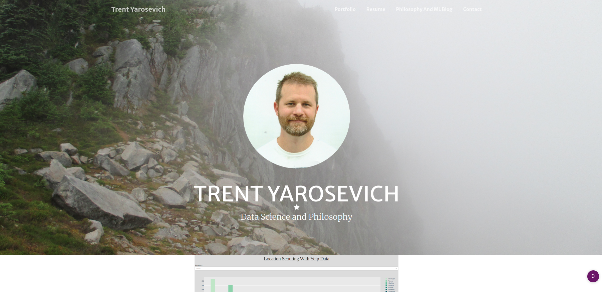

# Personal Website for Trent Yarosevich
This project is a fork of an opensource bootstrap theme that I've extended to create a personal website located [here](https://www.trenty.net).

# Preview

# Start Bootstrap
This project began as a clone of [this](https://github.com/StartBootstrap/startbootstrap-creative) template, which is available under the MIT license, as is my modification to it here. I encourage anyone interested to visit this repo, as the templates are flexible and already have a nice workflow implemented.

